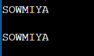
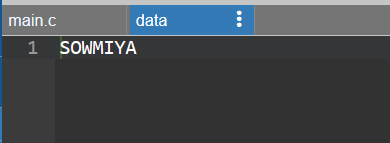

# EX.7-IMPLEMENTATION-OF-SYSTEM-CALLS-READ-WRITE-FORK-OPEN-CLOSE

## AIM:
To implement system calls as Read , Write , Fork , Open and Close.
## THEORY :
### read()
```

It is used to obtain data from a file on the file system. It accepts three arguments in general:
•	A file descriptor.
•	A buffer to store read data.
•	The number of bytes to read from the file.
The file descriptor of the file to be read could be used to identify it and open it using open() before reading.
```
### write()
```
It is used to write data from a user buffer to a device like a file. This system call is one way for a program to generate data. It takes three arguments in general:
•	A file descriptor.
•	A pointer to the buffer in which data is saved.
•	The number of bytes to be written from the buffer.
```
### fork()
```
Processes generate clones of themselves using the fork() system call. It is one of the most common ways to create processes in operating systems. When a parent process spawns a child process, execution of the parent process is interrupted until the child process completes. Once the child process has completed its execution, control is returned to the parent process.
```
### open()
```
The open() system call allows you to access a file on a file system. It allocates resources to the file and provides a handle that the process may refer to. Many processes can open a file at once or by a single process only. It's all based on the file system and structure.
```
### close()
```
It is used to end file system access. When this system call is invoked, it signifies that the program no longer requires the file, and the buffers are flushed, the file information is altered, and the file resources are de-allocated as a result.
```
## ALGORITHM:
```
1.	Star the program.
2.	Open a file for O_RDWR for R/W,O_CREATE for creating a file ,O_TRUNC for truncate a file.
3.	Using getchar(), read the character and stored in the string[] array.
4.	The string [] array is write into a file close it.
5.	Then the first is opened for read only mode and read the characters and displayed it and close the file.
6.	Use Fork().
7.	Stop the program.

```
## PROGRAM:
```
#include<sys/stat.h>
#include<stdio.h>
#include<fcntl.h>
#include<sys/types.h>
int main()
{
    int n,i=0;
    int f1,f2;
    char c,strin[100];
    f1=open("data",O_RDWR|O_CREAT|O_TRUNC);
    while((c=getchar())!='\n')
    {
        strin[i++]=c;
    }
    strin[i]='\0';
    write(f1,strin,i);
    close(f1);
    f2=open("data",O_RDONLY);
    read(f2,strin,0);
    printf("\n%s\n",strin);
    close(f2);
    fork();
    return 0;
}
```
## OUTPUT:


## RESULT:
Thus the implementation of system calls as Read , Write , Fork , Open and Close is done successfully.